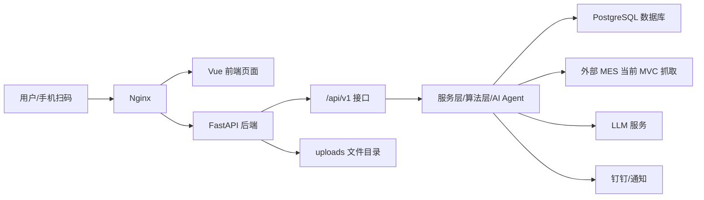

# 鑫泰铝业 数据中枢架构报告

生成时间：2026-06-05
范围：本地仓库、GitHub 主分支、云端运行代码、云端 PostgreSQL 数据库、Nginx 与 systemd 部署状态。

## 1. 当前真实状态

- 本地已提交版本、GitHub `origin/main`、云端 `/srv/aluminum-bypass` 当前提交一致，都是 `f4e95c8c863a60e0a7718fca77a5d0c1db2a711a`。
- 本地工作区还有未提交改动，主要是 SQL Server 直连 MES 改造、脱敏、预检、对账脚本和测试。
- 云端当前仍使用 `MES_ADAPTER=mvc`，不是 SQL Server 直连。
- 云端后端服务 `aluminum-bypass` 正常运行，健康检查 `/healthz` 与 `/readyz` 均正常。
- 云端数据库是 PostgreSQL，当前有 79 张表。

## 2. 系统总图

## 3. 前端架构

- 前端使用 Vue 3、Vite、Element Plus。
- 入口分为填报端 `/entry` 和管理端 `/manage`。
- 填报端包含今日任务、填报、辅材填报、历史记录、草稿箱等。
- 管理端包含生产实时、各车间看板、昨日报表、生产、填报明细、能源中心、考勤、异常、库存、合同、AI 助手、系统设置、用户管理、权限治理、主数据。
- 旧页面大多通过重定向指向新页面，说明系统经历过页面合并和入口清理。

## 4. 后端架构

- 后端使用 FastAPI。
- 主入口是 `backend/app/main.py`。
- 当前线上 OpenAPI 显示约 199 个接口。
- 后端分为路由层、服务层、领域算法层、数据模型层、适配层和自动任务层。
- 路由层负责接收前端请求。
- 服务层负责填报、日报、MES、能耗、库存、合同、考勤、成本、AI 等业务处理。
- 数据模型层通过 SQLAlchemy 映射 PostgreSQL 表。
- Alembic 负责数据库迁移，云端当前迁移版本是 `0037_remap_legacy_shift_references`。

## 5. 核心数据链路

### 填报链路

用户扫码或登录进入填报端，前端调用 `/api/v1/mobile`、`/api/v1/work-orders` 等接口，后端写入：

- `mobile_shift_reports`：班次/每日填报主记录。
- `work_order_entries`：按随行卡、机列、责任人记录的填报明细。
- `machine_energy_records`：机台级能耗明细。
- `shift_production_data`：汇总后的班次产量数据。

当前云端 `machine_energy_records` 仍为 0，这是能耗明细链路需要继续追根因的关键证据。

### MES 链路

云端当前通过 MVC 抓取外部 MES 数据，再写入本地投影表：

- `mes_coil_snapshots`：卷材/随行卡当前状态。
- `mes_stock_records`：入库数据。
- `mes_workshop_process_records`：车间工序记录。
- `mes_material_records`：投料/物料相关记录。
- `mes_yield_records`：成品率候选记录。

这些表再被管理端看板、日报、在制料、入库产量、对账等模块读取。

### 日报和自动任务链路

后端启动后会注册自动任务：

- 主数据种子。
- 每小时自动汇总与自动发布流水线。
- 每 30 分钟缺报提醒。
- 每小时 AI 简报。
- 每天铝价抓取。
- 每天经营快照。

这些任务由 systemd 运行的 FastAPI 进程内部调度。

## 6. 时间口径

- 主操、电工等生产填报口径：早上 7:30 开始算当天，每 24 小时一轮。
- 内勤每日填报口径：早上 10:00 开始算当天。
- 代码位置：`backend/app/core/business_time.py`。

## 7. 云端数据库关键数据

- `users`：242
- `workshops`：25
- `equipment`：243
- `mobile_shift_reports`：108
- `work_order_entries`：1400
- `machine_energy_records`：0
- `mes_coil_snapshots`：1198
- `mes_stock_records`：436
- `mes_workshop_process_records`：907
- `mes_material_records`：206
- `mes_yield_records`：145

## 8. 已生成的知识图谱

- 文件：`.understand-anything/knowledge-graph.json`
- 分析文件数：1267
- 节点数：1449
- 关系数：216
- 图层：填报端和移动端、管理端页面、前端接口层、后端接口层、后端业务服务层、数据库模型和迁移、外部系统集成、部署和运维、测试、其他文件。

注意：`@understand-anything/core` 依赖已经从官方源码安装并通过 `scan`、`batch`、`extract` 三段脚本验证。当前图谱仍是安装依赖前生成的确定性替代图谱，适合做架构理解和交接；如果要得到原版 LLM 深度语义图谱，需要重新运行 `understand` 全流程。

## 9. 当前最重要风险

- 能耗明细表线上没有数据，需要继续检查电工填报前端字段、后端保存接口和数据库映射是否断链。
- SQL Server 直连 MES 改造还在本地未提交状态，线上仍是 MVC 抓取，不要误以为已经切换。
- 本地未提交改动较多，继续施工前建议先做 review 和一次干净提交。
- 后端还有导入、模板等历史接口，前端已做合并，但后端冗余清理需要谨慎，不能直接删除。

## 10. 建议下一步

1. 先把 SQL Server 直连 MES 本地改造做完整 review、测试、提交。
2. 单独追踪电工能耗链路，确认数据到底卡在前端、接口、服务层还是表字段。
3. 把 `.understand-anything/knowledge-graph.json` 作为交接图谱继续补充页面到接口、接口到表的精确映射。
4. 如果要运行原版 `understand` 深度图谱，需要先修复本机 `@understand-anything/core` 插件依赖。
