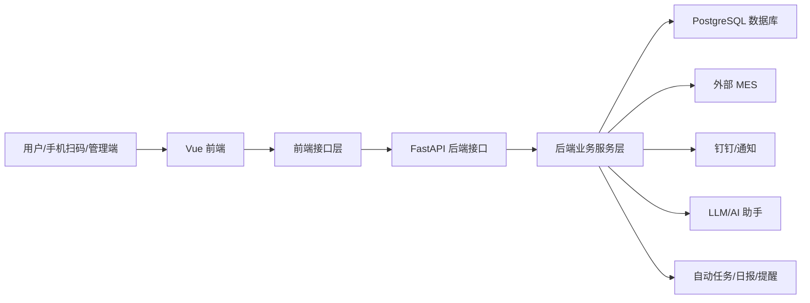
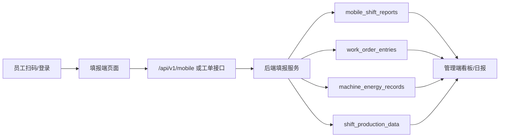
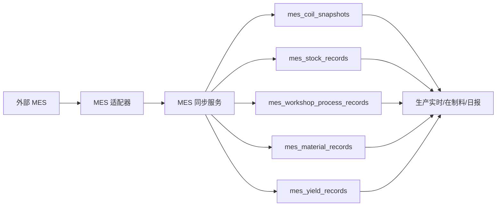
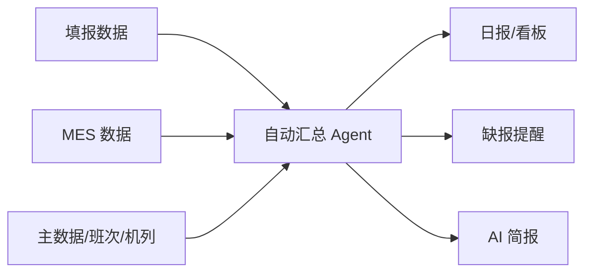

# 鑫泰铝业 数据中枢知识图谱中文说明

## 一句话理解

这是一个围绕“生产填报、MES 数据、管理看板、日报、能耗、AI 助手、权限治理”的数据中枢系统。前端负责让用户填报和查看，后端负责计算、保存、同步外部 MES 数据，数据库负责沉淀所有业务数据。

## 系统由哪些部分组成

## 图谱规模

- 分析文件：1267 个
- 图谱节点：1449 个
- 图谱关系：216 条
- 前端页面和代码：Vue、JavaScript、TypeScript、CSS
- 后端代码：Python、FastAPI、SQLAlchemy、Alembic
- 数据库：PostgreSQL
- 部署：Nginx、systemd、GitHub Actions、脚本

## 十个架构图层

### 1. 填报端和移动端

节点数：11

作用：给一线人员扫码、查看今日任务、填写产量、填写辅材、查看历史记录和草稿。

重点入口：

- `/entry`
- `/entry/fill`
- `/entry/history`
- `/entry/drafts`

### 2. 管理端页面

节点数：86

作用：给管理人员看生产实时、各车间看板、昨日报表、生产数据、填报明细、系统设置等。

重点入口：

- `/manage/live`
- `/manage/workshop-dashboard`
- `/manage/today`
- `/manage/production`
- `/manage/fill-details`
- `/manage/admin/settings`

### 3. 前端接口层

节点数：22

作用：前端不直接读数据库，而是通过这一层统一调用后端接口。

可以理解为：页面想要数据，先问前端接口层；前端接口层再去问后端。

### 4. 后端接口层

节点数：126

作用：接收前端请求，比如登录、填报、看板、MES、能耗、库存、AI 助手等。

核心入口：

- `backend/app/main.py`
- `backend/app/routers/`

### 5. 后端业务服务层

节点数：108

作用：真正处理业务规则，例如：

- 填报怎么保存
- 产量怎么汇总
- MES 数据怎么同步
- 能耗怎么计算
- 日报怎么生成
- AI 简报怎么生成
- 缺报提醒怎么判断

核心目录：

- `backend/app/services/`
- `backend/app/agents/`
- `backend/app/domain/`

### 6. 数据库模型和迁移

节点数：138

作用：定义数据库有哪些表、每张表有哪些字段，以及数据库结构怎么升级。

核心目录：

- `backend/app/models/`
- `backend/alembic/`

重点表：

- `mobile_shift_reports`：班次/每日填报主记录
- `work_order_entries`：随行卡、机列、责任人填报明细
- `machine_energy_records`：机台级能耗明细
- `shift_production_data`：班次产量汇总
- `mes_coil_snapshots`：MES 卷材当前状态
- `mes_stock_records`：MES 入库记录
- `mes_workshop_process_records`：MES 工序记录
- `mes_material_records`：MES 物料/投料记录
- `mes_yield_records`：MES 成品率候选数据

### 7. 外部系统集成

节点数：151

作用：连接外部系统。

主要外部系统：

- MES：当前线上仍是 MVC 抓取链路
- 钉钉：通知、工作流、用户同步
- LLM：AI 助手、AI 简报
- 通知服务：提醒缺报、异常等

### 8. 部署和运维

节点数：90

作用：让系统能在线上跑起来。

包含：

- Nginx 配置
- systemd 服务
- Docker/Compose 文件
- GitHub Actions
- 部署脚本
- 环境变量示例

### 9. 测试

节点数：343

作用：验证业务逻辑、接口、脚本、MES 同步、SQL Server 连接、脱敏等是否正常。

### 10. 其他文件

节点数：518

作用：文档、计划、辅助脚本、历史材料和暂未归入核心层的文件。

## 五步阅读路线

### 第一步：先看系统入口

看这两个文件：

- `backend/app/main.py`
- `frontend/src/router/index.js`

你会知道后端怎么启动，前端有哪些页面入口。

### 第二步：看填报端

看：

- `frontend/src/router/index.js`
- `/api/v1/mobile`

你会知道扫码填报、历史记录、移动端任务怎么进入后端。

### 第三步：看管理端

看：

- `frontend/src/config/navigation.js`
- `/api/v1/dashboard`
- `/api/v1/production`

你会知道生产实时、昨日报表、生产页、填报明细怎么组织。

### 第四步：看数据库

看：

- `backend/app/models/production.py`
- `backend/app/models/mes.py`
- `backend/app/models/energy.py`

你会知道填报、MES、能耗、日报相关数据分别落到哪些表。

### 第五步：看外部系统

看：

- `backend/app/adapters/mes_adapter.py`
- `backend/app/services/mes_sync_service.py`

你会知道 MES、钉钉、AI 等外部系统怎么接进数据中枢。

## 主要业务数据怎么流动

### 填报数据

### MES 数据

### 自动日报和提醒

## 当前图谱提醒

- `@understand-anything/core` 现在已经安装并通过脚本验证。
- 当前 `knowledge-graph.json` 是安装依赖前生成的确定性替代图谱。
- 如果要得到原版 LLM 深度语义图谱，需要重新运行完整 `understand` 流程。

## 现在最该关注的业务风险

- 能耗明细链路要继续查，因为线上 `machine_energy_records` 曾显示为 0。
- SQL Server 直连 MES 改造仍要以提交和部署状态为准，不能只看本地文件。
- 老的导入、模板、历史入口仍可能残留，清理前要查清是否还有页面或接口依赖。
- 管理端统计口径必须统一到业务时间口径，否则日报、今日、MES 在制料可能出现时间不一致。
