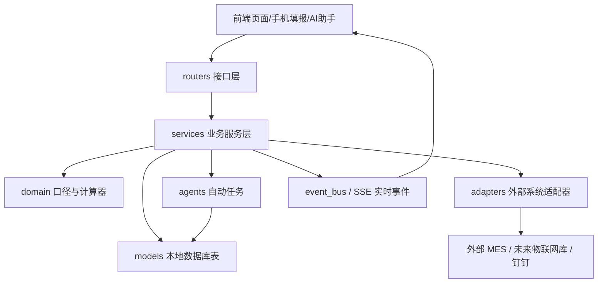

# 鑫泰铝业 数据中枢：后端架构风险图

日期：2026-06-11

状态：只读审计版，供后续修复 MES、能耗、实时大屏、卷级线索、AI 助手使用。

## 1. 这份图解决什么问题

前端页面只是“结果”。真正决定数字准不准的是后端：

1. 外部 MES 数据怎么进来。
2. 本地数据库怎么保存。
3. 算法怎么算。
4. 接口怎么给前端。
5. 定时任务什么时候自动汇总。
6. AI 助手读取哪些上下文。

如果这些链路没有梳理清楚，前端做得再漂亮，用户看到的数字也可能不可信。

## 2. 当前代码规模证据

CodeGraph 当前索引：

| 项目 | 数量 |
| --- | ---: |
| 索引文件 | 972 |
| 符号节点 | 14742 |
| 关系边 | 30663 |
| Python 文件 | 559 |
| Vue 组件 | 172 |

后端主要目录：

| 目录 | 文件数 | 行数 | 说明 |
| --- | ---: | ---: | --- |
| `backend/app/routers` | 35 | 6564 | 接口入口 |
| `backend/app/services` | 97 | 34252 | 业务逻辑主战场 |
| `backend/app/models` | 19 | 2174 | 数据库模型 |
| `backend/app/adapters` | 13 | 2699 | 外部系统适配 |
| `backend/app/agents` | 10 | 1863 | 自动汇总、催报、推送等确定性 Agent |
| `backend/app/domain` | 8 | 251 | 领域口径 |
| `backend/app/domain/calculators` | 5 | 165 | 小型计算器 |
| `backend/app/schemas` | 31 | 3254 | 接口数据结构 |
| `backend/tests` | 218 | 45016 | 测试 |

一句话：测试不少，但核心服务也很大，尤其 `realtime_service.py`、`factory_command_service.py`、`mes_sync_service.py`。

## 3. 后端分层地图

解释成白话：

- `routers` 像“前台窗口”，负责接请求、查权限、调用服务。
- `services` 像“办公室”，真正处理业务。
- `models` 是“账本”，保存数据库数据。
- `domain` 是“口径字典”，定义什么叫总产量、业务日、吨耗。
- `adapters` 是“外部联系人”，只读外部 MES 或其他系统。
- `agents` 是“自动员工”，定时做汇总、催报、推送。

## 4. 关键链路 1：外部 MES 到本地投影

证据：

- `backend/app/main.py` 会根据 `MES_ADAPTER` 创建外部 MES 适配器。
- `sqlserver` 适配器是 `backend/app/adapters/sqlserver_mes_adapter.py`。
- `SqlServerMesAdapter` 注释明确写着：只读 SQL Server，管理端仍读本地 `mes_*` 投影表。
- `backend/app/services/mes_sync_service.py` 负责同步和投影。
- `backend/app/models/mes.py` 保存卷、工序、库存、成品率等本地 MES 投影数据。

推荐口径：

1. 外部 MES 数据只读。
2. 同步到本地 `mes_*` 表。
3. 管理端和 AI 只读本地投影表。
4. 不允许前端直连 SQL Server。

风险：

- 机列字段不稳，很多记录是 `PC`、`WAN`、一体机名，不是明确机列。
- `MesAdapter` 有不少可选方法默认 `NotImplementedError`，如果调用方没做兜底，换适配器时会炸。
- `factory_command_service.py` 会把 MES 扩展数据、实时聚合、本地填报混合成页面数据，一旦来源标记不清，前端就不知道哪个数可信。

建议：

- 新增终端绑定表，把 `PC/WAN/一体机/IP/操作员/工艺` 映射到机列和工艺。
- 每条 MES 记录返回“匹配原因”，比如直接机列、别名、终端绑定、工艺推断、未匹配。
- 给 SQL Server 同步加只读健康检查、延迟报警、失败重试和字段变化检测。

## 5. 关键链路 2：业务时间

证据：

- `backend/app/core/business_time.py` 定义主操/电工业务日开始时间：`07:30`。
- 同文件定义内勤业务日开始时间：`09:30`。
- `metric_contracts.py` 已把 `production_business_date` 和 `owner_daily_business_date` 写进核心指标字典。

白话解释：

- 主操、电工：早上 7:30 到第二天早上 7:30 算同一个业务日。
- 内勤：早上 9:30 到第二天早上 9:30 算同一个业务日。
- 页面上如果把这两个口径混在一起，就会出现“今天、昨天、日报、MES 在制料数字对不上”。

风险：

- 前端 `inferBusinessDate`、后端 `resolve_production_business_date`、报表生成、MES 查询必须一致。
- 内勤补录窗口和 MES 工序时间窗口不是同一件事，不能混称。

建议：

- 所有核心接口都返回 `business_date_context`，告诉前端当前用的是哪个窗口。
- 自动测试固定几个时间点：`07:29`、`07:30`、`09:29`、`09:30`、`23:30`。

## 6. 关键链路 3：实时聚合和大屏

证据：

- `backend/app/routers/realtime.py` 提供 `/aggregation/live`、SSE、填报明细、缺报导出。
- `backend/app/services/realtime_service.py` 超过 2400 行，是实时大屏、缺报、填报明细、能耗、成品率的核心聚合服务。
- 前端 `/manage/live`、`/manage/today`、`/manage/fill-details`、`/manage/workshop-dashboard` 都依赖实时聚合。

风险：

- 这个服务影响面太大，任何字段改动都可能同时影响多个页面。
- 页面曾出现后端有数但前端显示 0，说明字段契约和状态语言还不够硬。
- 实时事件补丁如果只带部分字段，前端合并时可能影响完整快照。

建议：

- 给 `/aggregation/live` 建字段契约测试，至少覆盖 `factory_total.packaging_output`、`finished_inbound_output`、`energy_summary`、`overall_progress`。
- 给前端实时事件合并函数写测试，保证补丁不会把快照已有字段冲掉。
- 把“真实为 0”“未同步”“异常隔离”“接口失败”做成统一状态枚举。

## 7. 关键链路 4：能耗

证据：

- `backend/app/routers/energy.py` 已停用导入接口，提示使用电工/内勤每日填报。
- `backend/app/services/energy_service.py` 汇总 `machine_energy_records` 等本地能耗记录。
- `metric_contracts.py` 定义 `machine_energy_kwh` 主来源为 `machine_energy_records.energy_kwh`。

风险：

- 当前能源中心可以拿到电、气等明细，但如果产量分母是 0，吨耗会为空。
- 未来接物联网数据库时，如果直接替换页面来源，会把外部库稳定性风险传给前端。

建议：

- 物联网库只读同步到本地影子表，再汇总进统一能耗接口。
- 吨耗计算必须带分母来源：MES 包装产量、内勤入库、车间下机量，三者不能混。
- 能耗页必须展示“有能耗但无产量分母”的状态，而不是显示成 0。

## 8. 关键链路 5：手机填报和卷级补录

证据：

- `backend/app/routers/mobile.py` 提供当前班次、填报字段、报表保存、历史、MES 待补录、卷流向、按卷提交。
- `mobile.py` 中 `entry_fields` 会按角色过滤字段。
- `CoilEntryWorkbench.vue` 仍有直接 `api.get('/mobile/coil-flow-suggestion')`、`api.get('/mobile/coil-list/...')`、`api.post('/mobile/coil-entry')`。

风险：

- 手机填报是用户最直接接触系统的地方，任何字段错配都会马上影响现场。
- 现在“统一填报”和“按卷录入”并存，如果入口和场景不清楚，会让主操觉得更麻烦。
- 管理员浏览器测试不能代表机台二维码体验。

建议：

- 用真实机台二维码复测 `/entry`、`/entry/fill`、`/entry/coil`。
- 按卷录入页的直接 API 调用统一封装到 `frontend/src/api/mobile.js`。
- 以外部 MES 为主账，手机端只补 MES 没有的字段，且字段不锁死。

## 9. 关键链路 6：AI 助手和外部通讯

证据：

- `backend/app/services/ai_context_service.py` 会读取工厂调度、机列、卷级、刷新状态等上下文。
- `backend/app/services/assistant_service.py` 有 LLM 使用量限制和记录。
- `backend/app/models/assistant_usage.py` 存储 AI 使用量。
- `backend/app/main.py` 定时生成 AI briefings。

风险：

- AI 如果没有来源和更新时间，会让用户把不确定回答当成事实。
- AI 上下文如果包含敏感 payload，可能泄露外部系统字段。
- 群助手必须只读，不能写生产数据。

建议：

- AI 回复必须带证据来源、业务日、更新时间。
- 对 AI 上下文继续执行敏感字段脱敏测试。
- 钉钉群助手先做“只读日报/异常播报”，不要做“群里改数据”。

## 10. 自动任务和 Agent

证据：

- `backend/app/main.py` 启动时会注册定时任务。
- 自动任务包括：默认班次种子、确定性汇总、催报、AI 小结、铝价、经营快照。
- `backend/app/agents` 里有汇总、催报、报告、校验、成本、利润、铝价等 Agent。

当前自动任务：

| 任务 | 频率 | 风险 |
| --- | --- | --- |
| `deterministic_pipeline` | 每小时 | 如果口径错，会自动生成错误日报 |
| `reminder_sweep` | 每 30 分钟 | 如果业务日错，会误报缺报 |
| `ai_hourly_briefing` | 每小时 | 如果上下文错，会主动推错结论 |
| `aluminum_price_daily` | 工作日 10:30 | 外部数据失败需降级 |
| `executive_daily_snapshot` | 每天 08:20 | 依赖上一业务日口径 |

建议：

- 所有自动任务都要记录本次运行的业务日、数据来源、跳过原因。
- 自动汇总前必须过 readiness gate，尤其是 MES、能耗、核心指标。
- 自动任务失败不能拖垮 `/readyz`，部署健康和外部数据健康要分开。

## 11. 最大架构风险清单

### 阻塞

1. `realtime_service.py` 过大且影响多个核心页面，必须先加字段契约测试。
2. MES 终端到机列匹配不稳，不能直接完全自动归属。
3. 能耗和产量分母口径未完全对齐，吨耗容易误导。
4. 业务时间有 07:30 和 09:30 两套口径，必须接口显式返回。
5. 合同、库存、报表等页面业务价值不清，不能直接进入主导航。

### 高风险

1. 外部 MES adapter 方法较多，适配器切换时有未实现方法风险。
2. 部分页面绕过统一 API 模块，测试和错误处理不统一。
3. 自动任务会写数据，必须有 readiness gate 和回滚证据。
4. AI 可读上下文越来越多，必须持续脱敏和权限过滤。
5. 主数据种子和账号治理会影响二维码、机列和历史追溯。

### 体验风险

1. 用户看不懂 0、空、未同步、接口失败、异常隔离的区别。
2. 卷级线索没有单独核心页，用户仍要在多个页面找一卷料。
3. 填报端如果同时保留多个入口但解释不清，会显得更复杂。

## 12. CEO 视角评分

评分：9.7/10。

判断：系统的方向对，最有价值的是“外部 MES 主账 + 人工补录 + 异常审核 + 实时指挥”。但要先保证数据可信，不能先追求大屏视觉。

扣分原因：还缺真实车间现场确认 PC/WAN/一体机绑定规则。

## 13. 工程视角评分

评分：9.5/10。

判断：后端分层基本清楚，测试量不少，但核心服务太大，字段契约需要更硬。下一步最应该做的是给实时聚合、MES 匹配、能耗、业务时间写自动测试。

扣分原因：还没有跑完整测试套件，也没有完成逐文件逐函数审计。

## 14. 设计视角评分

评分：9.5/10。

判断：后端复杂度最终会落到用户体验上。设计上必须把页面从“很多后台模块”收敛成“实时指挥、昨日报表、卷级线索、异常处理、基础配置”几条清晰路径。

扣分原因：还缺真实浏览器截图级状态审查，比如加载、空数据、错误、权限不足、移动端溢出。

## 15. 下一步建议

下一轮建议做“核心接口契约测试计划”，先列出每个核心接口必须稳定返回的字段：

1. `/aggregation/live`。
2. `/mes/supplement-readiness`。
3. `/factory-command/coils`。
4. `/factory-command/destinations`。
5. `/energy/summary`。
6. `/mobile/current-shift`。
7. `/mobile/mes-pending-supplements`。
8. `/assistant/live-probe`。

有了契约测试，再动前端大屏和卷级线索页，风险会低很多。
