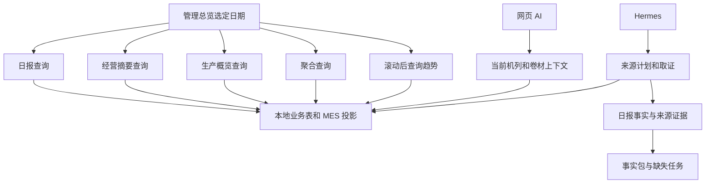
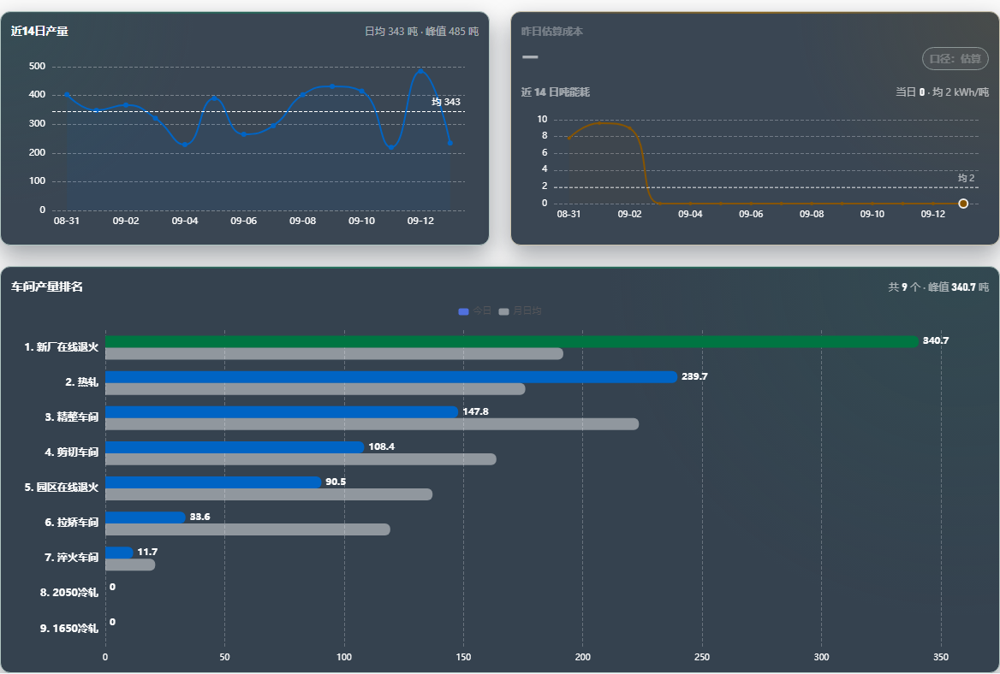
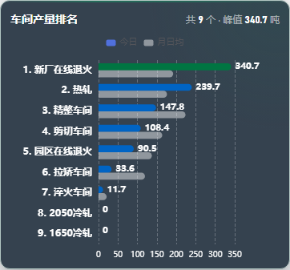
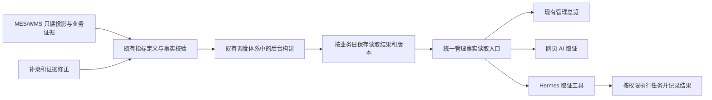

# 管理看板响应、图表与智能体协作复盘

日期：2026-09-14。状态：分析交付与待确认方案，尚未实施本报告中的业务改造。

入口：[当前封档基线](../../README.md) · [业务术语](../../../CONTEXT.md) · [逐文件覆盖清单](./2026-09-14-review-coverage.csv)

## 1. 先说结论

**允许数据延迟，有利于提速；关键是后台提前计算、访问时复用结果。仅把“实时”改成“按日期查询”，不会自动消除慢查询。** 当前页面已经传日期，但仍在打开时执行经营摘要、生产概览、日报等计算。

本轮同时发现两个比速度更先要守住的问题：缺失能耗被画成零；网页 AI 没有收到看板所选日期和事实版本，请求失败还可能退回只回复“收到”的旧接口。把这些结果缓存起来，只会让错误更稳定地出现。

建议顺序：先纠正管理总览的缺失值和指标替代，再建立可追溯的按日读取结果，最后让网页和 Hermes 从同一个事实入口取数。保持现有 `/manage`，不再建设另一套门户或智能体。

本轮唯一 P0 建议：**管理总览在正常与接口失败情况下，都不把缺失、入库量、在制量显示成包装产量或零能耗。** 用这一小段真实链路作为后续提速的正确性基线。

用户动作：当前无需操作系统。已提出的业务选择仍待回复：当天数据每 15 分钟、每小时更新，还是主要查看已完成班次/昨日。本报告以“当天约 15 分钟、历史按日”作讨论假设，未把它作为已批准配置。

## 2. 本轮查到了哪里

### 2.1 当前版本与证据边界

| 项目 | 本轮观察 | 能证明什么 |
|---|---|---|
| 本机、GitHub、生产数据中枢 | `78bfc56fea55c425a9906f85efe89d76f5a9434b` | 当前检查基于同一业务代码版本 |
| 生产 Hermes 独立仓库 | `ed804da122b0a547c942fa6170b635a3c0901ee2` | 独立部署存在；本轮未逐文件审阅该仓库 |
| 数据中枢、Hermes gateway、nginx | 服务均 active | 进程运行，不等于每个业务任务成功 |
| readyz、近期错误级日志 | ready；抽查近 15 分钟错误级日志为 0 | 基础运行正常，不证明正式日报已就绪 |
| MES 同步 | 最近成功，观察时延迟约 26 秒 | 同步近期运行；不证明每个字段准确 |
| IoT 能源 | unconfigured | 尚未配置这一来源，不能据此把缺失能耗当零 |

先读封档入口，再核对 Git、结构索引、关键源码、只读生产样本和浏览器。历史综合文档体量很大，本轮查阅入口、章节及相关内容，没有把旧文档的完成率当成当前事实。

对跟踪的代码与配置文件做了全库结构扫描：**1,299 个文件，324,178 行**，记录行数、内容指纹和定义信息。主要范围包括后端服务、路由、模型、适配器、任务、迁移，前端页面、组件、API、状态管理，以及测试、脚本和发布工作流。文档、依赖、构建产物及独立 Hermes 仓库不在这组代码统计中。

结构索引在当前 checkout 重建，得到 16,449 个节点、100,551 条边。工具未返回可核对的 `head_sha` 属性，所以证据是“当前工作树重建且 HEAD 未变”，不是伪造索引版本字段。快速索引不含全部脚本和文档，图中没有调用边不能直接证明代码无人使用。

**全库扫描不等于逐行语义审计。** 本轮对管理总览、图表、报表事实、定时任务、网页 AI、Hermes 接口做了重点源码复核；其余文件只完成结构盘点。CSV 逐项标明“结构扫描”或“关键链路源码复核（部分文件节选）”，避免把覆盖数量冒充所有业务均验收。

### 2.2 各层职责与本轮深度

| 层 | 本轮重点 | 处理原则 |
|---|---|---|
| 一线填报、主数据、权限 | 全库结构盘点；未重新做完整填报验收 | 保护 `/entry`、后端权限和审计，不因看板改造绕过校验 |
| MES/WMS、生产、卷材、合同 | 投影查询、产量口径、当前状态与历史日期交叉复核 | 外部只读；存量与期间流量分开 |
| 能耗、成本、质量、考勤 | 复核管理看板的能耗/成本读取；其余以结构扫描为主 | 缺失必须显式，未全量验收的业务不宣告正常 |
| 报表、事实包、历史汇总 | 关键构建器、持久化和生产表样本 | 部分看板事实与正式日报发布条件分开 |
| 管理前端 | 数据组合、图表转换、桌面/手机截图 | 同日期、同单位、同指标；失效时不能换口径凑数 |
| 网页 AI 与 Hermes | 请求入口、取证、生产编排、投递边界与 trace 元数据 | 复用事实能力，权限和外发边界保留 |
| 测试、迁移、运维、发布 | 全库清单，相关既有测试与生产服务检查 | 未运行全量测试，不声称本轮 CI/部署验收 |

## 3. 当前链路为什么会慢、会对不上



这些路径有各自的合理用途，但目前没有保证“页面这一格数字”和“智能体这一句解释”引用相同业务期间、指标定义和事实版本的公共入口。

### F1：页面按日查询，后端仍现场组装多份数据

证据：[`useDashboardSnapshot.js`](../../../frontend/src/composables/useDashboardSnapshot.js) 的 `load` 同时请求经营摘要、日报、生产概览，各自返回后独立显示；这改善了等待方式，但每次创建页面仍会请求。`TodayPage.vue` 还有聚合读取，趋势图按需请求。

[`dashboard_builder.py`](../../../backend/app/services/report/dashboard_builder.py) 的 `build_factory_dashboard`（约 484 行）组合多个领域结果；`build_timeseries`（1079 行）在日期循环内逐日查询能源。查询 30 天仍可能做 30 次日能源计算。

[`contract_progress_projection_service.py`](../../../backend/app/services/contract_progress_projection_service.py) 的 `build_contract_progress_projection`（44 行）全表读取卷材投影、工单、工单记录后再分组。`target_date` 用于部分停滞和当日推进判断，不能把当前卷材状态变成任意历史日期的状态。

结论：减少前端刷新次数主要减少重复负载；首次进入、换日期、多人同时访问仍需要后端预计算或更小的查询。`TodayPage` 本身不是每 30 秒轮询页面，不能误把其他看板的轮询配置当成这里的根因。

### F2：图表把“没有数据”变成“数值为零”——已复现

生产只读调用 `build_timeseries`，2026-09-12 至 2026-09-13 返回：

| 业务日期 | 接口产量，kg | 接口能源 |
|---|---:|---|
| 2026-09-12 | 484700 | `null` |
| 2026-09-13 | 234450 | `null` |

[`_costPanel.js`](../../../frontend/src/components/manage/_costPanel.js) 第 10 行使用 `Number(row.energy ?? 0)`。对 9 月 13 日样本，转换结果为 234.45 吨、能源 0、吨能耗 0。生产截图也出现“当日 0”。这是转换错误，不能解释成节能成果。

同类问题：[`_outputTrend.js`](../../../frontend/src/components/manage/_outputTrend.js) 把缺失产量转成零；[`OutputTrendLine.vue`](../../../frontend/src/components/manage/OutputTrendLine.vue) 用“是否存在大于零的产量”判断有无数据，真实全零也可能被当成没数据。后端趋势接口还会省略产量和能源均为零的日期，所以只改前端不足以保证完整时间轴。

需要区分：已知为零、缺失、接口失败、正在刷新。比例指标缺分子或分母时不计算；只有完整覆盖同一范围的数据才能算期间吨电耗。若只计算部分日期，必须标识覆盖范围，不能伪装成全期间。

### F3：图表主题与日期文案没有跟随工作台——已复现

[`WorkshopBarChart.vue`](../../../frontend/src/components/manage/WorkshopBarChart.vue) 使用深色卡片和反白文字；图例仅设字号，未显式设置与背景匹配的颜色。当前浅色根主题下，深色卡片仍保留，图例暗、辨认困难。`CostLine` 和产量趋势卡也继续使用深色背景。

选择历史日期时，图例仍写“今日”，成本标题写“昨日估算成本”。应绑定所选日期或使用准确的期间标签，不增加大段说明文案。

手机截图显示 9 个车间条形图较拥挤，但本轮没有证据证明某一行已被裁掉。应把长名称、更多车间、横竖屏和收起后重新展开加入验收。





用户提到的“树状图”：当前源码检索没有定位到明确的 ECharts tree/treemap/sankey 配置，可能指条形图或工序结构图。本轮确认的是上面这些图表问题，不能声称已识别用户指的全部图。

### F4：接口失败后的替代数据可能换了指标——源码确认

[`useDashboardSnapshot.js`](../../../frontend/src/composables/useDashboardSnapshot.js) 的 `leaderMetrics` 在多个结果之间回退，其中包装产量路径可能采用 `storage_finished_weight`；`productionLane` 在缺少日报车间数据时可采用 `active_tons`。

入库量、在制量与包装产量不是同一指标。回退应该只允许“同指标、同期间、同权限范围”的等价证据。否则保留缺失并指出失败来源。不同指标仍可以各自展示，但不能拿来补同一个数字。

这是错误分支风险，已由源码定位；本轮没有主动破坏生产接口来证明真实用户已遇到该分支。

### F5：已有历史快照，不能直接当现成看板缓存——代码与生产共同确认

[`reports.py`](../../../backend/app/models/reports.py) 已有 `DailyFactBundleSnapshot`、`DailyReportHistoryRecord`、`OperationPeriodSnapshot`。

本轮生产只读样本：事实包快照 62 条、事实包运行 62 条且状态均为 blocked；日报历史归档 0 条；期间汇总快照 0 条。最新 9 月 13 日运行记录报告缺失 94、冲突 4。它们是各自记录的状态和计数，不能换算成正式日报通过率。

[`period_rollup.py`](../../../backend/app/services/report/period_rollup.py) 读取日报历史表，支持月、完整月、年、完整年；不是任意起止日期的全指标看板。其映射集中在产量、成本和能源费用，不能用空表宣称已经具备快速历史查询。

[`daily_fact_bundle.py`](../../../backend/app/services/report/daily_fact_bundle.py) 的定时闭包可更新同键快照内容，`created_at` 不是每次更新的数据截止时间。它不直接满足看板需要的不可混淆版本和新鲜度语义。

可复用的部分也存在：[`daily_report_fact_closure.py`](../../../backend/app/services/report/daily_report_fact_closure.py) 的 `build_persisted_daily_fact_surface` 已读取持久化事实包和缺失任务。应复用事实来源与缺失规则，再补齐看板读取能力，不能另建一套事实标准。

正式日报继续遵守 127 字段合同。看板可显示经过查证的部分指标，但必须保留缺失状态；这不意味着正式日报可以放宽门槛。`D:\输出skill` 始终只用于比较，不参与填数证明。

### F6：网页 AI 与所看日期脱节；失败可能被“收到”掩盖

[`AiAssistantDrawer.vue`](../../../frontend/src/components/ai/AiAssistantDrawer.vue)、[`ai-chat.js`](../../../frontend/src/stores/ai-chat.js) 传问题、intent、scope，没有把看板选定日期、指标和事实版本传给回答链。

[`ai_context_service.py`](../../../backend/app/services/ai_context_service.py) 的 `build_context_pack`（334 行）主要读取当前同步状态、机列和卷材；`answer_from_context`（399 行）生成这一上下文下的答案。记录的 10 分钟 `expires_at` 不等于已实现共享查询缓存，此函数每次仍生成上下文。

更直接的问题：`ai-chat.js` 约 251 行捕获新接口的所有失败，再调用旧 `/ai/chat`；[`ai.py`](../../../backend/app/routers/ai.py) 的 `chat` 在约 309、340 行生成 `收到：{body.message}`。因此不只旧版本兼容问题，超时或其他错误也可能变成表面正常的回声回答。

整改目标：让失败可见；页面提问携带当前期间和事实版本；回答应区分“已查到”“证据不足”“任务已创建”“动作已完成”。不能把收到问题或创建 trace 当成完成查证。

### F7：不能把整个 Hermes 群聊处理器接到网页上

[`hermes_root_owner_production_orchestrator.py`](../../../backend/app/services/hermes_root_owner_production_orchestrator.py) 有来源计划、证据收集和任务编排，同时包含渠道、运行记录、外发等业务动作。

应复用 [`hermes_root_owner_evidence_service.py`](../../../backend/app/services/hermes_root_owner_evidence_service.py) 等已存在的取证能力，以及事实字段合同；不能把带管理员身份和钉钉投递副作用的整段编排直接作为普通网页读接口。

本轮生产元数据中，最近的几条 agent run 是 smoke trace；去除 smoke 后抽查到的最近记录为 9 月 5 日、9 月 1 日。样本存在 `answered` 且对应 outbox 为 0，不能由此断言未投递，因为还存在 gateway 直接回复路径。历史外部消息日志中存在 failed 和 retrying，也不能把历史累计当成当前故障。

另一个可见性缺口：持久化日报表面数据返回 `agent_failure_audit: unavailable` 并给出空失败列表。空列表不能被 UI 解读为“智能体没有失败”。

### F8：时间边界仍需核对，不能先缓存再说

当前 [`business_time.py`](../../../backend/app/core/business_time.py) 定义通常生产业务日切点 07:50，部分铸造/热轧范围 10:00。旧历史文档中的 07:30 不能直接用于新汇总；班次时间与业务日切点也不应强行混为一谈。

本轮 readiness 样本的 MES `last_event_at` 显示为当日约 23:17，而检查时约 15:19。存在约 8 小时时间差的线索；可能涉及来源时区、映射或时钟，尚未定位根因。上线基于时间的新鲜度判断前，应验证原始值、数据库类型、转换和显示各层，不能拿未来时间证明“特别新鲜”。

## 4. 不要求实时，具体应该怎么设计

### 4.1 三种时间各管一件事

| 概念 | 示例 | 作用 |
|---|---|---|
| 统计期间 | 某业务日、近 7 日、本月、明确起止日期 | 决定算哪一段业务 |
| 生成频率 | 当天每 15 分钟重新计算 | 决定用户最多容忍多旧的结果 |
| 数据截止时间 | 这一版实际覆盖至哪个来源事件 | 告诉用户数字反映到哪里 |

后台刚生成，不代表来源刚更新。显示刷新时间不能代替显示事实截止时间。历史有补录或来源修正时也会变化，不能将“过去的日期”永久冻结。

PostgreSQL 官方资料说明，持久化查询结果可减少读取开销，但结果不一定实时。这里采用的是这种预计算思路，尚未决定使用数据库物化视图；多来源、权限和版本需求要先满足。[官方说明](https://www.postgresql.org/docs/current/rules-materializedviews.html)

### 4.2 最多三个候选动作

| 方案 | 业务收益 | 限制与风险 | 建议 |
|---|---|---|---|
| 继续缩小 SQL、合并重复查询 | 冷查询和后台构建都受益，容易逐项回滚 | 每次访问仍重复算；无法保证网页与 AI 同一版 | 作为局部优化持续使用 |
| 只给 HTTP 请求加短期缓存 | 改动较小，重复访问变快 | 第一次慢；权限、缺失、日期和修改失效很容易遗漏 | 不作为最终整体方案 |
| 后台按业务日生成管理读取结果 | 页面读取快，多人复用，能携带来源与版本 | 要处理补录、构建失败、历史存量及权限隔离 | 作为后续目标，先在总览少数指标试点 |

### 4.3 复用事实层，只收口一个读取入口



按照 codebase-design，这应是一个 **Deep Module**：外部只面对小的 **Interface**，指标选择、来源校验、版本选择、汇总和失效规则留在 **Implementation**。实际 **Seam** 是管理页面与取证工具共同需要的事实读取边界。只在真实存在的网页身份、Hermes 调用身份及测试数据差异处设置 **Adapter**，不为未来假想平台加接口。

不另造第二套业务事实。先复用 `DailyFactBundle` 的字段定义、来源规则、缺失检测，以及已有生产业务日工具和 scheduler。已有归档表不能覆盖完整需求时，才评估一个管理读取结果表；不能为了复用表名而改变正式日报快照含义。暂不引入 Redis、新消息队列或独立服务。

讨论中的最小 Interface：

```text
输入：经后端验证的权限范围、业务起止日期、所需指标、指定版本或更新策略
输出：业务期间、事实版本、生成时间、来源截止时间、覆盖范围、指标集合
每个指标：值或缺失、单位、指标定义、来源引用、完整性/冲突状态
```

必须同时满足：

1. **先验权限再查结果。** 前端提交的 scope 不决定授权。缓存键包括有效授权范围、日期、指标定义版本与修订版本；必要时包含用户专有范围。Hermes 管理员结果不能流入普通用户的缓存。
2. **一次发布一个完整版本。** 前端独立加载可以保留，但跨接口合并前校验版本；不能把前一版产量配后一版能源。多来源的不同截止时间在指标层保留，不能只给一个含糊“已更新”。
3. **冷启动不挤爆数据库。** 每个键同一时刻只构建一次；查询无结果时返回明确的准备状态，后台排队。超时重试有上限，不能每个浏览器请求都启动一遍重算。
4. **补录按受影响范围失效。** 修正某车间某业务日，只重算该日和引用它的期间结果；不清空全库。旧版本保留来源和修改原因，禁止静默改掉 AI 已引用的版本。
5. **旧结果有使用条件。** 刷新失败时，只有权限仍有效、未撤回、未被标记为错误且未超过可接受时间的上一版可以继续显示，并标识过期。被纠错的版本不能因“可用”就继续当事实。
6. **汇总按指标性质。** 产量等期间流量可在不重复计数前提下求和；库存/在制取截止时点，不能相加；吨耗用同覆盖范围的总能耗除以约定总产量。缺失天数、冲突和覆盖不足必须传播到结果。
7. **历史不能凭当前状态倒推。** 没有历史事件或时点快照的合同/在制指标，返回该历史能力暂不可用。先验证实际有历史证据的指标，再扩展范围。

### 4.4 系统与智能体如何配合

数据中枢负责：权限、确定性计算、来源存储、证据版本、任务状态与审计。

Hermes 负责：理解问题，选择指标与期间，查证，判断冲突，必要时创建有授权的追证或执行任务，检查实际结果。

网页和钉钉分别保留自己的入口、身份和发送方式，共用事实读取能力。网页“解释当前看板”默认绑定所看版本；用户明确询问最新情况时才读取新版，并说明版本已变化。问题本身指定其他日期时，必须解析或澄清，不能硬用当前页面日期。

旧回声接口先核对实际调用者与兼容依赖，再从正常回答路径退出。新接口出错应保留错误与 trace，不能用另一种成功响应掩盖；不因这项收口删除其他仍有用户的 AI 页面。

业务完成证据至少分清：问题已接收、证据已读取、答案已生成、动作已请求、动作已执行、渠道已投递。这些是运行记录应有的语义，不要求给用户增加六块状态面板。

## 5. 图表整改标准

| 问题 | 最小整改 | 验收 |
|---|---|---|
| 缺失变成零 | 保留 null；缺失不进入均值，趋势缺口不连成节能曲线 | 生产缺失样本、真实零、零分母三种结果不同 |
| 数据失败换指标 | 禁止包装产量回退到入库/在制 | 模拟每个独立接口失败，卡片指标不变 |
| 深色图表留在浅色页面 | 使用当前管理端颜色，显式设置图例、坐标、网格、提示框 | 实际桌面/手机可读，与总览一致 |
| 日期错称今日/昨日 | 标签绑定选定业务日期与期间 | 今日、昨日、跨月查询文字准确 |
| 日期被省略、全零无图 | 返回完整日期及可用状态，全零仍是有效数据 | 连续日期、停产日、缺失日不会混淆 |
| 小屏拥挤 | 按真实车间数、名称和可用宽度布局 | 390px、长名称、更多条目、切换屏幕后无遗漏 |

ECharts 的主题与容器尺寸需要分别处理；主题适配不等于容器自动正确，容器变化还需正确 resize。具体使用既有 Vue 图表组件，不先更换图表库。[样式文档](https://echarts.apache.org/handbook/en/concepts/style/) · [容器尺寸文档](https://echarts.apache.org/handbook/en/concepts/chart-size/)

## 6. 实施顺序：每一步验收后再选择下一步

### P0：管理总览的数字不能在缺失或降级时变成另一回事

范围限于能耗/产量趋势的数据转换、完整日期状态，以及总览中跨指标回退。配套修正这些图的主题和日期标签；不扩展所有管理页面。

先加能够复现 null→0、真实零被隐藏、失败后取在制量的测试，再做最小修改。使用同一生产日期样本回查接口、卡片和图形。正式日报 127 字段门槛保持不变。

完成标准：上述错误分支被测试覆盖；真实缺失在页面上不再显示零；包装、入库、在制三种值保持独立；桌面/手机截图通过人工查看；现有日期旧响应保护与 AI 首次问题发送回归仍通过。

失败回滚：回退这一批提交，保留原始数据；本阶段不改数据库事实。当前请求是分析方案，本报告未开始这一实现阶段。

### 后续候选一：按日读取结果，实测提速

前置：P0 通过，用户确认可接受时效，核对业务日与来源时区；按封档规则确认现有一线填报阶段的真实验收状态。

试点只包含已有真实来源的管理总览指标及其趋势。先生成少量业务日、对比原始查询结果，再切换少量访问。逐步增加 7 日、30 日区间；一年范围先测负载与覆盖，不立即开放无限重算。

后台建设完成后继续优化构建中最慢的 SQL，避免页面快了、数据库却被后台任务拖垮。保留读路径开关，失败可以回到原有接口；不得取消权限、审计或发布门槛。

### 后续候选二：网页与 Hermes 共用取证结果

前置：公共事实读取契约经过真实数据验收。网页携带日期/指标/版本，Hermes 工具接同一读取入口；核对授权身份，区分取证与外发。修正吞错回声行为。

验收必须包含真实用户问题及可回查证据，不能只用 smoke 的 answered 状态。测试动作使用受控、不外发路径；真实外发仍按用户授权执行。

## 7. 本轮验证与后续验收不是同一件事

### 本轮实际完成

| 验证 | 结果与限制 |
|---|---|
| Git、生产版本、服务与健康 | 已核对；不替代前端资源及业务验收 |
| 全库结构扫描、索引重建 | 已完成；逐文件清单附后，不是全代码逐行审计 |
| 生产数据库查询 | 只读事务、语句超时、最小汇总样本；未修改事实 |
| 桌面 1440px 与手机 390px 图表检查 | 已截图，未观察到脚本错误；本轮图表取证禁用了 Service Worker，不能证明普通用户缓存升级正常 |
| 单次浏览器请求计时 | 日报约 8.20 秒、聚合 11.05 秒、趋势 12.25 秒、生产概览 14.30 秒、经营摘要 17.28 秒；并发请求且时点不同，不用于推断与上轮的性能改善比例 |
| 缺失值最小复现 | null 能耗转换为 0，已复现；未在本轮修复 |
| 既有相关前端测试 | 22 项通过；这些测试未覆盖上述缺失值错误，绿灯不是无缺陷证明 |

测试命令，在 `frontend` 目录运行：

```powershell
node --test tests/manageWorkshopBarChart.test.js tests/manageCostLine.test.js tests/manageDashboardSnapshot.test.js
```

图表计时来自浏览器请求生命周期，不是服务器独占耗时，也不是 p95。证据 JSON 的 request records 未保存 HTTP 状态字段，因此不能只凭该字段断言所有请求 200。

对应的 [浏览器观测记录](./assets/2026-09-14-chart-review.json) 保存了图表文字、容器尺寸、颜色、错误列表和请求计时，不含登录凭据或用户消息。

### 后续必须补齐的验收

| 维度 | 必测场景 |
|---|---|
| 事实 | 缺失、零、冲突、补录、单位转换、包装/入库/在制分离 |
| 时间 | 07:50 与适用范围 10:00 前后、跨月跨年、完整日期、未来来源时间 |
| 权限 | 至少管理员与不同车间用户；缓存不得跨权限污染，撤权即时生效 |
| 版本 | 页面和 AI 同一版；刷新、旧请求晚到、修正后旧版引用可追溯 |
| 任务 | 冷启动、多人同时首次请求、构建超时、重启、失效与重新生成 |
| 图表 | 桌面与手机、长标签、全零、缺失、收起展开、正确单位与日期 |
| 性能 | 分开测有结果/无结果、7/30/365 日范围；记录样本数、并发、SQL 次数及数据库负载 |
| 正式发布 | CI、构建资源、正式域名与正常 Service Worker 浏览器；不能只核对 Git SHA |
| 智能体 | 选定历史日期问题、证据不足、取证失败、执行失败与投递失败；每种状态可追溯 |

建议性能目标（尚未达成，也未作为承诺）：预计算结果存在时，数据读取接口 p95 小于 1 秒，主要数字可见 p95 小于 2 秒。以至少 3 个授权会话、20 次以上重复样本作初测，同时单独记录无结果时的等待和数据最大延迟。正式容量目标仍需按实际用户规模确定。

## 8. 仍未定案的事项

1. 当天数据允许延迟多久：已向用户提出一个问题，等待回复。15 分钟只是假设。
2. 用户说的“树状图”是否就是本轮截图的车间条形图，还是另一页面的工序结构图。
3. MES 时间差的具体来源；历史日报归档为空的运行原因；独立 Hermes 仓库的完整实现。不能仅由当前数据中枢索引推断它们。
4. 哪些历史存量指标具备可重建证据。没有证据的日期不可用当前快照回填。

本次不新增已接受的架构 ADR，也不改写封档方向。待更新频率及试点验收边界确认后，再将真实、难以逆转的存储与版本决策写成 ADR；普通实现选择不另造一批文档。
